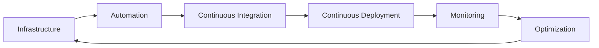

# Hi there 👋

I'm Christian Josef, and I'm passionate about cloud-native technology. As a Cloud/DevOps Engineer, I love staying up-to-date with the latest advancements in this fast-moving field. I'm always eager to learn and explore new tools and methods to keep myself and my team ahead of the game.

## 🚀 About Me
- 🔭 I'm currently working on optimizing cloud infrastructure and automating workflows
- 🌱 I'm currently learning advanced Kubernetes and serverless architecture
- 💬 Ask me about cloud computing, DevOps best practices, or anything tech-related!
- 📫 How to reach me: [LinkedIn](https://www.linkedin.com/in/cjosefaquino/)

## 🛠️ Technologies & Tools

## 📊 GitHub Stats

  
  

## 🔥 Contribution Streak

## 📈 My DevOps Journey

## 🤝 Let's Connect!

  
  

---
⭐️ From [Christian Josef](https://github.com/chrstnjsff)
